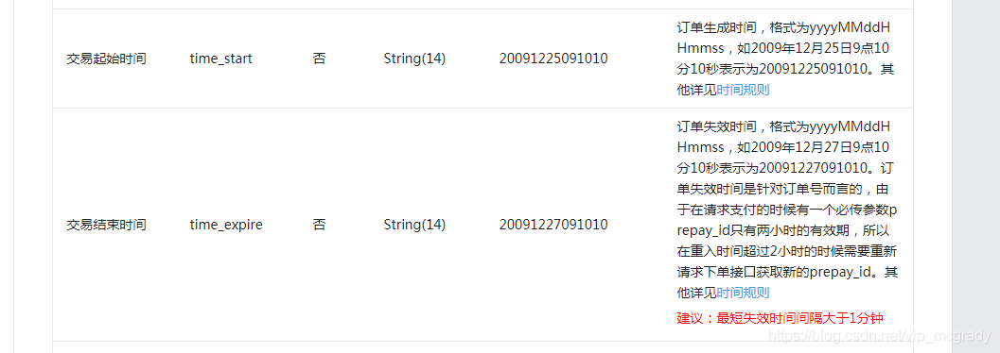
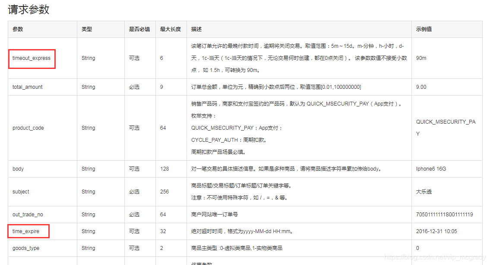

# bibabo-trade
##建表sql
交易系统
交易系统属于请求聚合层，聚合多个微服务计算结果并返回
类似于控制器


seata服务端所需sql脚本
```sql
-- -------------------------------- The script used when storeMode is 'db' --------------------------------
-- the table to store GlobalSession data
CREATE TABLE IF NOT EXISTS `global_table`
(
    `xid`                       VARCHAR(128) NOT NULL,
    `transaction_id`            BIGINT,
    `status`                    TINYINT      NOT NULL,
    `application_id`            VARCHAR(32),
    `transaction_service_group` VARCHAR(32),
    `transaction_name`          VARCHAR(128),
    `timeout`                   INT,
    `begin_time`                BIGINT,
    `application_data`          VARCHAR(2000),
    `gmt_create`                DATETIME,
    `gmt_modified`              DATETIME,
    PRIMARY KEY (`xid`),
    KEY `idx_status_gmt_modified` (`status` , `gmt_modified`),
    KEY `idx_transaction_id` (`transaction_id`)
) ENGINE = InnoDB
  DEFAULT CHARSET = utf8mb4;

-- the table to store BranchSession data
CREATE TABLE IF NOT EXISTS `branch_table`
(
    `branch_id`         BIGINT       NOT NULL,
    `xid`               VARCHAR(128) NOT NULL,
    `transaction_id`    BIGINT,
    `resource_group_id` VARCHAR(32),
    `resource_id`       VARCHAR(256),
    `branch_type`       VARCHAR(8),
    `status`            TINYINT,
    `client_id`         VARCHAR(64),
    `application_data`  VARCHAR(2000),
    `gmt_create`        DATETIME(6),
    `gmt_modified`      DATETIME(6),
    PRIMARY KEY (`branch_id`),
    KEY `idx_xid` (`xid`)
) ENGINE = InnoDB
  DEFAULT CHARSET = utf8mb4;

-- the table to store lock data
CREATE TABLE IF NOT EXISTS `lock_table`
(
    `row_key`        VARCHAR(128) NOT NULL,
    `xid`            VARCHAR(128),
    `transaction_id` BIGINT,
    `branch_id`      BIGINT       NOT NULL,
    `resource_id`    VARCHAR(256),
    `table_name`     VARCHAR(32),
    `pk`             VARCHAR(36),
    `status`         TINYINT      NOT NULL DEFAULT '0' COMMENT '0:locked ,1:rollbacking',
    `gmt_create`     DATETIME,
    `gmt_modified`   DATETIME,
    PRIMARY KEY (`row_key`),
    KEY `idx_status` (`status`),
    KEY `idx_branch_id` (`branch_id`),
    KEY `idx_xid_and_branch_id` (`xid` , `branch_id`)
) ENGINE = InnoDB
  DEFAULT CHARSET = utf8mb4;

CREATE TABLE IF NOT EXISTS `distributed_lock`
(
    `lock_key`       CHAR(20) NOT NULL,
    `lock_value`     VARCHAR(20) NOT NULL,
    `expire`         BIGINT,
    primary key (`lock_key`)
) ENGINE = InnoDB
  DEFAULT CHARSET = utf8mb4;

INSERT INTO `distributed_lock` (lock_key, lock_value, expire) VALUES ('AsyncCommitting', ' ', 0);
INSERT INTO `distributed_lock` (lock_key, lock_value, expire) VALUES ('RetryCommitting', ' ', 0);
INSERT INTO `distributed_lock` (lock_key, lock_value, expire) VALUES ('RetryRollbacking', ' ', 0);
INSERT INTO `distributed_lock` (lock_key, lock_value, expire) VALUES ('TxTimeoutCheck', ' ', 0);
```

##支付超时后自动取消问题
创建订单时会发生一条延时消息，因为无法满足事务一致性，还会有补漏job处理。
可如果我们系统已经取消，但是用户停留在第三方支付平台（如：支付宝、微信）的时间，
超过了我们的支付超时时间，用户仍然可以支付成功，但订单已经是最终态取消状态。
那么会走逆向退款流程，这会给用户造成困扰。

如何解决？
这类问题无法单独在我们系统内解决，需要三方支付平台的配合，提供支付超时相关参数
，也就是超时的check也要在三方支付平台生效。
###微信

订单的生单时间和订单的失效时间
###支付宝

timeout_express假设在收银台场景，代表的是用户正确输入密码，支付宝受理这笔订单业务开始计时15分钟，
在已签约支付宝代扣的业务情况下，则是轮询扣费的轮询定时时间，并不是之前臆想的，后端送的请求时间timestamp+timeout_express是过期时间。
time_expire，这个参数是绝对超时时间，也就是支付宝在time_exipre时间点后，就不会对订单进行受理处理。
time_expire缺点：服务器时间和支付宝服务器时间不一致，可能会有延迟。
time_expire优点：app支付是需要正确输入密码之后才会创建交易的，这个时候timeout_express才开始计时，而使用time_expire可以避免这个问题。